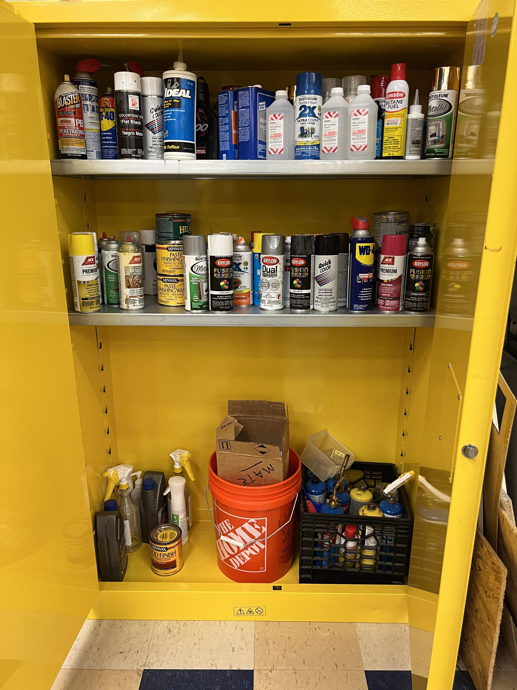

# Flammables Cabinet

## Location

The flammables cabinet is located behind the electronics workstation, close to the other entrance to the Design Lab.

## Items

The flammables cabinet stores any item classified as flammable. This includes:

- Spray Paint
- Alcohol
- Blow Torches
- Gasoline
- Acetone
- Any Aerosol Spray
- Any Flammable Gas/Liquid
- Any Chemically Volatile Compounds

