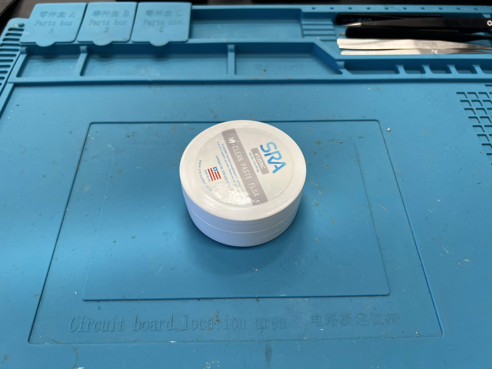

# Electronics Station

The Exeter Design Lab electronics workstation (station) next to the secondary entrance of the laboratory. It is equipped with the following facilities:

Ever-increasing list

- Space for 2+ people
- Pinecil V2
- Selection of Weller Soldering Irons
- Kotto Fume Extractor
- Lead-Free Solder (thin/thick)
- Desoldering Wick
- Assortment of Multimeters
- Solder Sucker
- Flux
- Brass Sponge and Normal Sponges
- Desoldering Alloy
- PCB Holders
- Anti-static, heat-resistance silicone workspace
- Precision tweezers
- Helping Hands/Magnifying Glass
- Wires (header pins, alligator clips, low/high gauge, hookup (magnet) wire)
- 99% Isopropyl Alcohol

*Photo of the electronics workstation, taken 5/27/23 after extensive cleanup (it usually doesn't look this tidy)*

## Rules

Please...

- Use the **Pinecil V2 solder irons** (feel free to bring your own USB-C/barrel jack power supply)
  - Read the next section on how to use the these particular soldering irons. They take a bit to get used to, but they are awesome tools.
- Use **lead-free (PBF)** solder
- Always have the **fume extractor** pointed at the source of fumes
- Use **consumable items** (solder, desoldering wick, flux, desoldering alloy, etc.) responsibly

Treat this place with respect and kindness, and please follow the rules!

## Soldering

Using the electronics workstation assumes at least basic knowledge in soldering and electronics. We understand that everyone has their own way of soldering, and we want to provide the freedom for everyone to experiment and figure out what works best for them. If confused, please contact a Design Lab proctor.

[By the way, here is a wonderful tutorial on soldering from Adafruit's Colin's Lab.](https://www.youtube.com/watch?v=QKbJxytERvg&pp=ygUWYWRhZnJ1aXQgaG93IHRvIHNvbGRlcg%3D%3D)

## Pinecil V2

> [Here is the manual.](https://wiki.pine64.org/images/1/1f/USER_MANUAL_-_QUICK_START_PINECIL_multi_lang_EU%2BDE%2BFR.pdf)

> [Here is the PINE64 wiki.](https://wiki.pine64.org/wiki/Pinecil)

### Basic Usage

Heat the tip: plug Pinecil into an appropriate power supply.

1. Clicking [+] starts the tip heating.
2. The detailed display option shows power draw, current temperature, supply voltage, and time until sleep mode starts.
3. Adjust the target temperature with further clicks of [+] and [-] buttons. Long hold allows for changes in increments of 10 C˚.
4. Wait a few seconds for the regular display to return, then hold down [-] for a moment to turn the heat off.
5. You can observe the temperature measurement go up and down. Certain settings involve holding down both buttons (see GitHub IronOS for details on firmware settings).

:::info

The recommended temperature range for the Pinecil in regular usage is `380 C˚ ± 20 C˚`

:::

## Other Tools

### Fume Extractor

> Saves your lungs. Please replace the filter if it becomes too dirty.

### Multimeter

> Like a ruler but for electronics. Measures voltage, current and resistance (continuity beeps as well).

### Flux

> Makes soldering easier by removing the oxidation layer from solder.

### Solder Sucker

> Sucks up molten solder

### Desoldering Wick

> Wicks up molten solder

