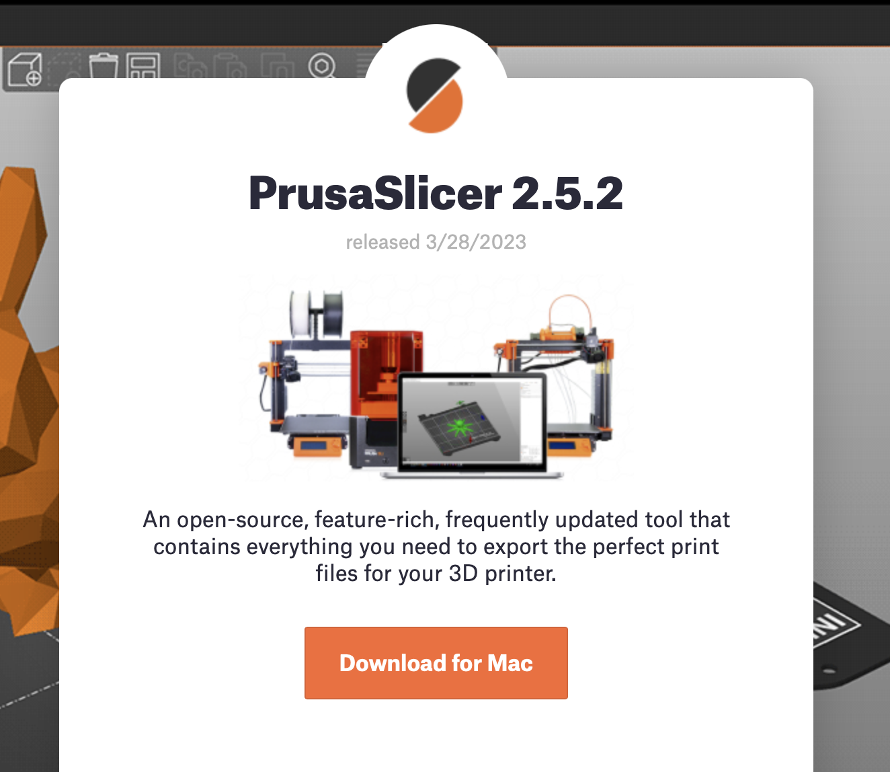
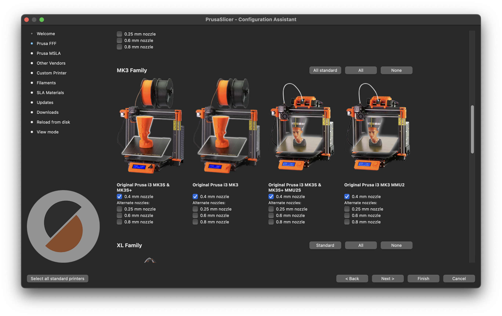
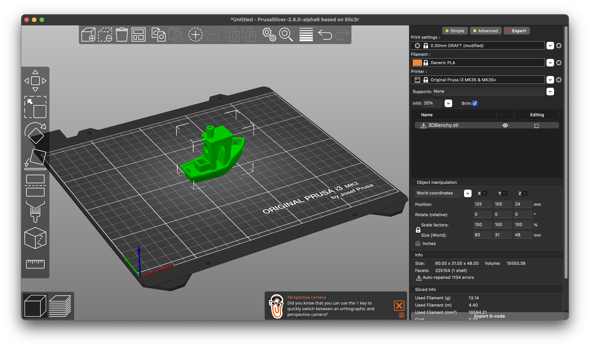
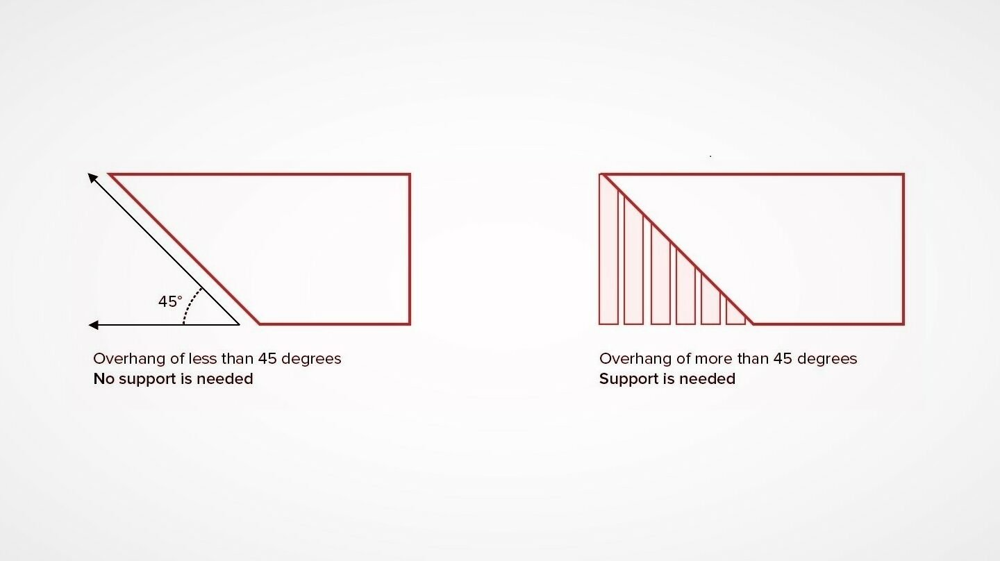
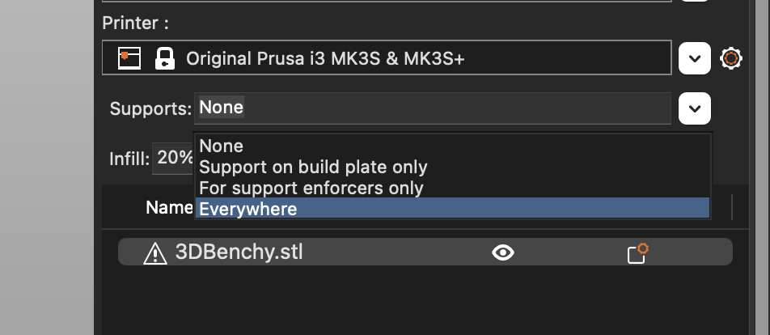
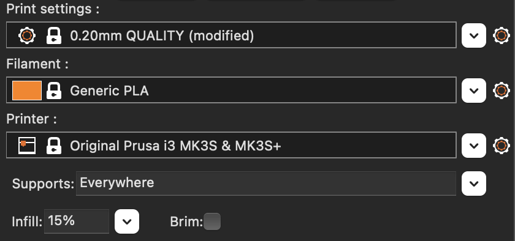
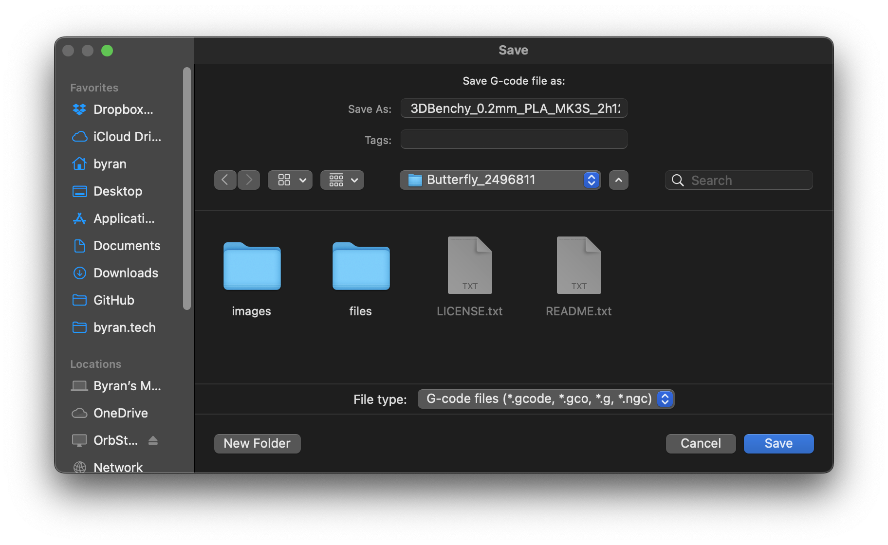
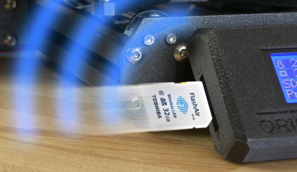
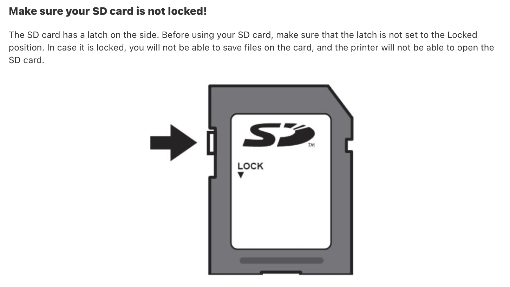

# Prusa MK3S Printers

There are two Prusa MK3S 3D printers in the lab towards the back corner.

*Prusa MK3S FDM printer*

## How to Use

Using the Prusa 3D printers is very simple. Despite that, if this is your first time using a 3D printer, it is highly encouraged for you to find a **student proctor** that can guide you through the process.

## Software

Hopefully you have something you want to print in your mind. The `PrusaSlicer` software takes STL files (think of them as files that store your 3D design) as input and outputs `gcode`, which is what the printer understands. To do this, **download the [latest PrusaSlicer software.](https://www.prusa3d.com/page/prusaslicer_424/)**

:::info

If for any reason you cannot download PrusaSlicer on your personal computer, you can use one of the lab's laptops. PrusaSlicer is preinstalled, so just skip to the Overhangs/Supports section.

:::

*Download the [latest PrusaSlicer software](https://www.prusa3d.com/page/prusaslicer_424/)*

## Settings

In the setup wizard, select **Original Prusa MK3S & MK3S+** with the **0.4mm nozzle** option. This is what the printers use.

With the software set up, drag in your STL file:

## [Overhangs/Supports](https://all3dp.com/1/3d-printing-support-structures/)

[Overhangs](https://all3dp.com/1/3d-printing-support-structures/) are when your 3D model has sections that are floating in mid air. As you might be able to imagine, these can't be printed without adding **supports!**

If there are [overhangs](https://all3dp.com/1/3d-printing-support-structures/), then add supports within PrusaSlicer:

## Brim

If the surface area to the base of the print is smaller than a quarter, a brim is necessary. To enable this option, tick the "Brim" checkbox in the top right.

## Other Configurations

There are countless configurations within PrusaSlicer that can be adjusted for the perfect print. To read more on that, feel free to browse the [Prusa 3D documentation](https://help.prusa3d.com/category/print-settings_212). However, everyone is busy here, so here are safe go-to settings (be sure to read the "Brim" and "Overhangs/Supports" sections above to see if you need either):

## Compiling `gcode`

Press `CTRL+G` (Windows), `CMD+G` (macOS) or `META+G` (Linux) to export the `gcode` to your computer.

## Uploading to the Printer

In the future, both printers will use OctoPrint, which is cloud connected. For now, there are two options:

1. If you have an SD card reader, plug in the SD card that is in the printer and drag the `gcode` file in. DO NOT UNPLUG THE SD CARD WHEN THE PRINTER IS RUNNING.

2. If you don't have an SD card reader, use one of the laptops lying around the lab. Transfer the `gcode` from your computer to one of the lab's laptops and do step 1. *If you are already using a Design Lab laptop, just insert the SD card and transfer the `gcode`*.

:::note

:::

## Printing

Plug the SD card back into the printer, and it should say something like `loading files...`. Select your file with the knob and press down on it.

:::danger

**You must watch the first layer of your print.** If it does not print according to the settings (i.e. filament wraps around nozzle, unexpected printing locations, "spaghetti"...), press the "X" next to the screen and stop the print. Contact a Design Lab Proctor.

:::

The estimate time will show up on the screen after the printer has completed the preheating and calibration procedures. Please return in a timely manner to grab the print.

:::caution

The gray-ish bed on the printer can be lifted away from the printer. Once removed, bend the thin metal sheet to "pop" the prints off. DO NOT USE TOOLS TO REMOVE PRINTS. If the print is difficult to remove, contact a Design Lab Proctor.

:::

Happy Printing!

*QR code for this page*
